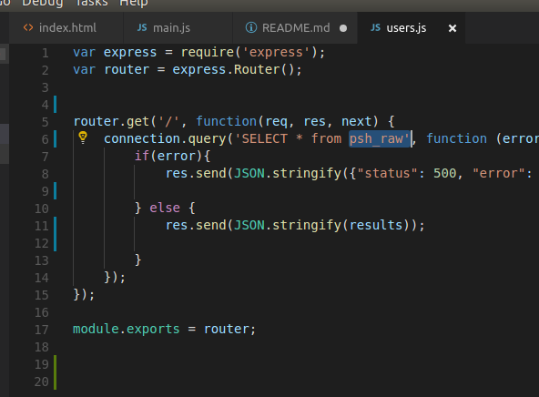
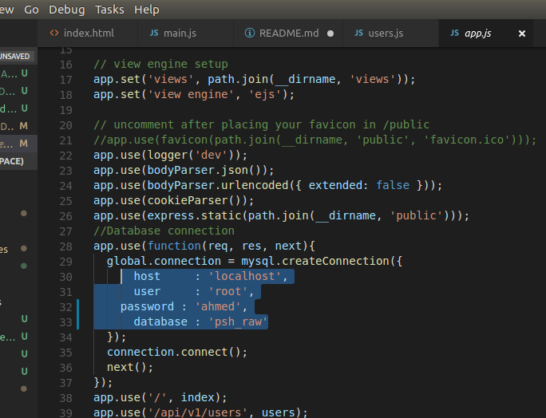

<h1>Admision System</h1>

<b> This project is an Admission system single page website built on REST API, JavaScript and Bootstrap. </b>

<h3>Prerequisites</h3>
<ul><a href="https://nodejs.org/en/download/">Node.js</a>
 Be sure to select the option to add Node to your PATH
</ul>
<ul>
 After you install Node, install Express by running   <i>npm install express-generator -g</i>
</ul>
<ul><a href="https://code.visualstudio.com/">Visual Studio</a></ul>

Now you are good to git clone or download the project 
open terminal 
cd (dir)        -- folder you git cloned 
npm install         -- response should be npm up to date in 0.444s 
npm start       -- the starts node.js server
  

open your favourite browser and your page should be up at 
http://localhost:4001/          -- Homepage 
http://localhost:4001/api/v1/users          -- Api page 
  

<b>Note: if you want to connect to Mysql Database do this</b> 
open terminal 
cd (dir)        -- folder you git cloned 
npm install mysql       -- install Mysql packages on express 
open user.js in Visual studio and change your DATABASE NAME 
  
open app.js in Visual studion and change you DATABASE LOGIN DETAILS 

  

<b>you will find my Database file in the folder you can import it to see how it works</b>

